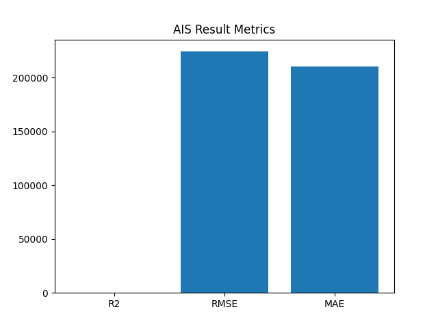

# 🚀 Food Subsidy Optimization & Forecasting System

🧠 Optimized using Bio-Inspired Algorithms (AIS, CSA, PSO)

---

## 👤 Author

**Sagnik Patra**

---

## 📌 Project Overview

This project builds an **end-to-end Machine Learning pipeline** to analyze, predict, and optimize **Food Subsidy Allocation** using advanced bio-inspired optimization algorithms.

The system processes raw government subsidy data and generates:

* 📊 Insights through visualization
* 🤖 Predictive models
* 🧬 Optimized feature selection using metaheuristic algorithms
* 📁 Exportable results (CSV, JSON, YAML, Models)

---

## 🎯 Objectives

* Analyze food subsidy trends
* Predict future subsidy requirements
* Optimize feature importance using AI algorithms
* Compare multiple optimization techniques
* Generate meaningful visual insights

---

## ⚙️ Algorithms Used

| Algorithm        | Purpose               |
| ---------------- | --------------------- |
| 🌳 Random Forest | Base prediction model |
| 🧬 AIS           | Feature optimization  |
| 🐦 CSA           | Feature optimization  |
| 🐟 PSO           | Feature optimization  |

---

## 📊 Visualization

### 🔥 AIS Result Metrics Graph

> ⚠️ IMPORTANT: Place your generated image `ais_result_graph.png` inside the project root folder.



---

### 📈 Other Graphs

| Graph            | File                       |
| ---------------- | -------------------------- |
| Heatmap          | `ais_heatmap.png`          |
| Accuracy Graph   | `ais_accuracy_graph.png`   |
| Comparison Graph | `ais_comparison_graph.png` |
| Prediction Graph | `ais_prediction_graph.png` |

---

## 📂 Project Structure

```
Food Subsidy Optimization & Forecasting System/
│
├── Dataset.csv
│
├── ais_model.pkl
├── ais_scaler.pkl
├── ais_results.csv
├── ais_predictions.csv
├── ais_results.json
├── ais_config.yaml
│
├── csa_model.pkl
├── pso_model.pkl
│
├── ais_heatmap.png
├── ais_accuracy_graph.png
├── ais_comparison_graph.png
├── ais_prediction_graph.png
├── ais_result_graph.png
│
└── README.md
```

---

## 📈 Generated Outputs

### 📊 Graphs

* Heatmap (feature correlation)
* Accuracy graph (R²)
* Comparison graph (RMSE vs MAE)
* Prediction vs Actual graph
* Result metrics graph

### 📄 Files

* Results CSV (`*_results.csv`)
* Predictions CSV (`*_predictions.csv`)
* JSON results (`*_results.json`)
* YAML config (`*_config.yaml`)
* Model files (`*.pkl`)

---

## 🔄 Workflow

1. 📥 Load Dataset
2. 🧹 Clean & preprocess data
3. 🔀 Train-test split
4. ⚙️ Feature scaling
5. 🤖 Train ML model
6. 🧬 Apply optimization algorithm (AIS / CSA / PSO)
7. 📊 Generate predictions & metrics
8. 📈 Create visualizations
9. 💾 Save outputs

---

## 💡 Key Features

* ✔ Fully automated pipeline
* ✔ Supports multiple optimization algorithms
* ✔ Robust error handling
* ✔ Export-ready outputs
* ✔ Visualization-driven insights

---

## ⚠️ Limitations

* Dataset is very small (demo purpose)
* Optimization algorithms require larger datasets for accurate results

---

## 🚀 Future Enhancements

* Add large-scale dataset (1000+ rows)
* Build Streamlit dashboard
* Hybrid models (AIS + PSO)
* Deploy as web app
* Real-time data integration

---

## 🏆 Conclusion

This project demonstrates how **Machine Learning + Bio-Inspired Algorithms** can be used to:

✔ Predict subsidy trends
✔ Optimize decision-making
✔ Generate actionable insights

---

## ⭐ Support

If you like this project, give it a ⭐ on GitHub!
